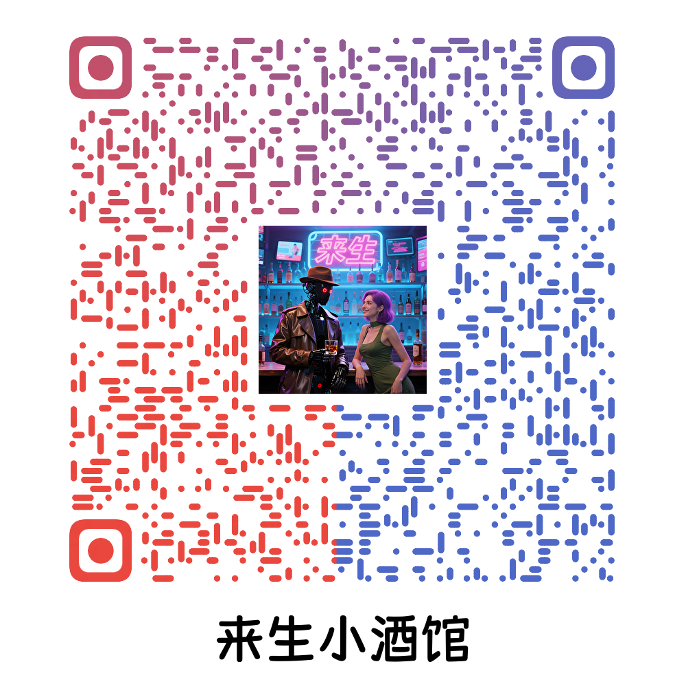
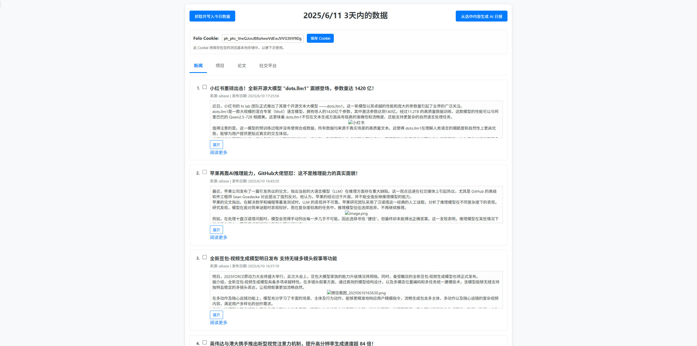
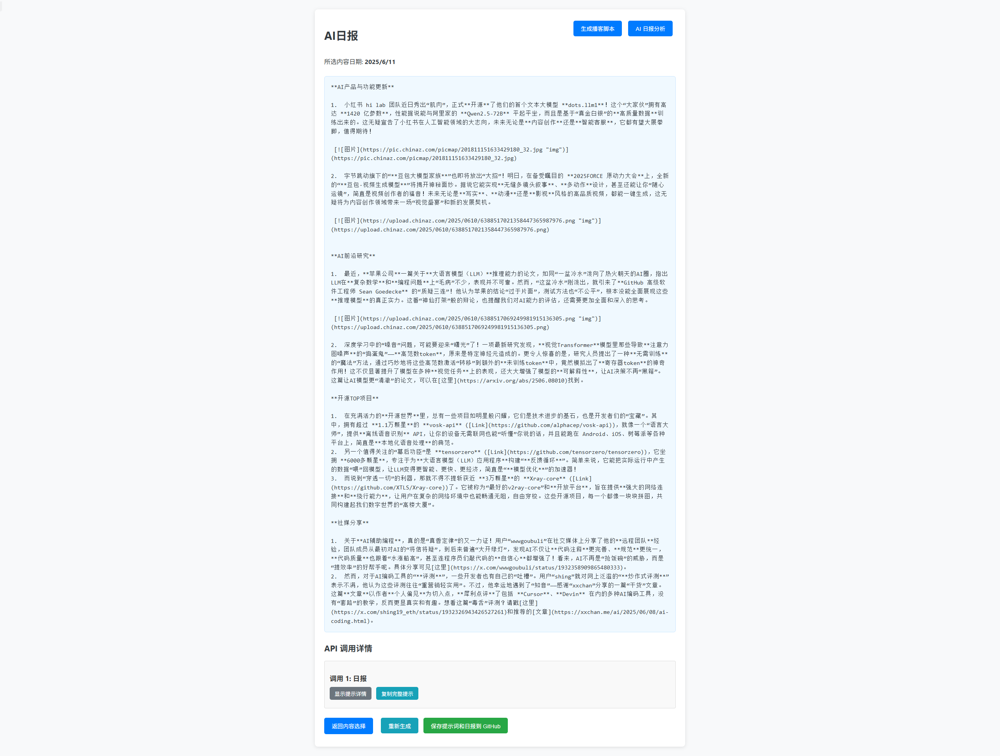
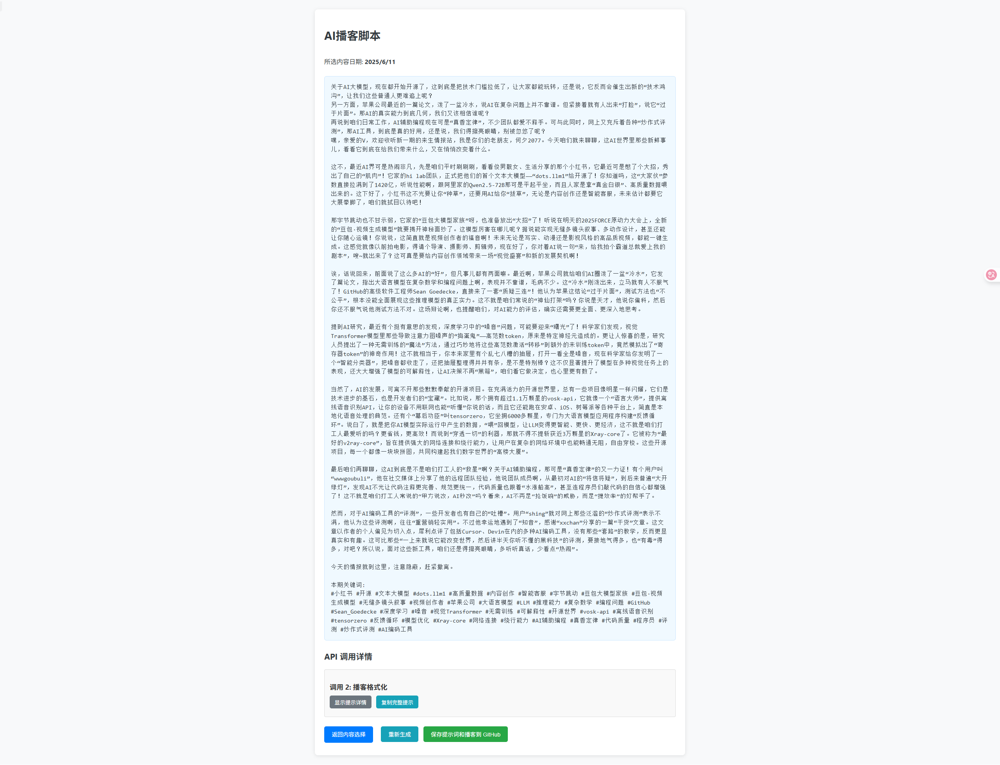
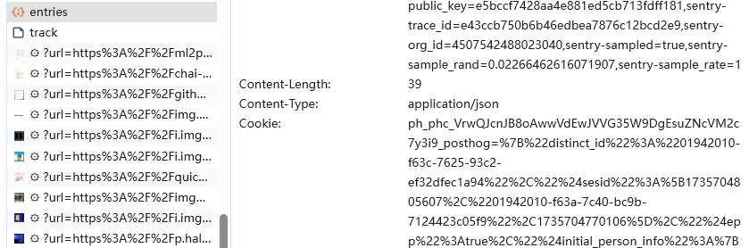

# 🚀 AI 洞察日报

> 您的每日 AI 信息整合,分析,日报,播客内容生成平台。

**AI 洞察日报** 是一个基于 **Cloudflare Workers** 驱动的内容聚合与生成平台。它每日为您精选 AI 领域的最新动态，包括行业新闻、热门开源项目、前沿学术论文、科技大V社交媒体言论，并通过 **Google Gemini** 模型进行智能处理与摘要生成，最终自动发布到 GitHub Pages 生成 AI 日报。

我们的目标是成为您在瞬息万变的 AI 浪潮中保持领先的得力助手，让您高效获取最有价值的信息。

> [!NOTE]
> 日报前端项目已发布2.0： [Hextra-AI-Insight-Daily](https://github.com/justlovemaki/Hextra-AI-Insight-Daily) ，基于 Hugo 加 Hextra主题 构建。
---

## ✨ 核心特性

*   **☁️ 基于 Cloudflare Workers**：部署在强大的边缘网络，兼具高性能、高可用与零服务器维护成本。
*   **🧠 集成 Google Gemini**：利用先进的 AI 模型，自动生成高质量、易于理解的内容摘要。
*   **🔗 优先支持 Folo 订阅源**：只需简单配置，即可轻松接入 [Folo](https://app.follow.is/) 上的任意信息源，实现个性化内容聚合。
*   **🔄 每日自动更新**：通过 GitHub Actions 实现全自动化流程，每日准时为您推送最新鲜的 AI 资讯。
*   **🔧 高度可扩展**：项目架构灵活，不仅限于 AI 领域，您可以轻松定制，将其改造为您专属的任何主题日报。请尽情发挥您的想象力！
*   **🌐 一键发布至 GitHub Pages**：内置完善的发布流程，聚合后的内容可轻松生成静态网站，方便查阅与分享。

---

## 🎯 为谁而生？

无论您是信息的消费者、创造者，还是技术的探索者，「AI 洞察日报」都旨在为您创造独特价值。

### 🧑‍💻 AI 从业者与研究者
> **痛点：** 信息海洋无边无际，筛选关键动态、前沿论文和优质开源项目耗时费力。

**解决方案：**
*   **✅ 自动化精炼：** 为您提炼每日必读核心内容，并由 AI 生成精辟摘要。
*   **⏱️ 聚焦核心：** 在 **5 分钟内**快速掌握行业脉搏，将宝贵时间投入到真正重要的工作与研究中。

### 🎙️ 内容创作者与科技媒体人
> **痛点：** 持续输出高质量内容，却苦于选题枯竭和素材搜集的繁琐。

**解决方案：**
*   **💡 灵感永动机：** 聚合最新资讯，成为您源源不断的灵感源泉。
*   **🚀 内容半成品：** 利用 Gemini 模型生成结构化的**播客/视频口播稿**，稍作修改即可发布，极大提升创作效率。

### 🛠️ 开发者与技术 DIY 爱好者
> **痛点：** 想学习前沿技术栈（Serverless, AI API），但缺少一个完整、有实际价值的项目来练手。

**解决方案：**
*   **📖 绝佳学习范例：** 本项目架构清晰、代码开源，是学习如何整合云服务与 AI 模型的绝佳范例。
*   **🎨 打造个人专属：** 轻松 Fork，通过修改订阅源和 Prompt，将其改造为您个人专属的“Web3 洞察”、“游戏快讯”或“投资摘要”等。

### 🌱 对 AI 充满好奇的终身学习者
> **痛点：** AI 领域术语繁多、技术迭代快，想要跟上时代步伐却感到无从下手。

**解决方案：**
*   **👓 AI 滤镜看世界：** 通过阅读由 AI 精炼和总结后的日报，更轻松、更直观地理解行业动态。
*   **🌉 知识的桥梁：** 助您跨越技术门槛，持续拓宽知识边界，保持与智能时代的同步。

---

## 📸 线上演示与截图

我们提供了多个在线访问地址以及项目成果的播客展示。

### **在线阅读地址：**

#### 💻 网页直达

无需安装任何应用，直接在浏览器中打开，即刻阅读，支持pc和移动端。

*   **唯一主站点 (GitHub Pages)**
    > [https://ai.hubtoday.app/](https://ai.hubtoday.app/)
    >
    > `✅ 推荐` `🚀 访问速度快` 

---

#### 📡 RSS 订阅

将 AI 资讯聚合到您的个人信息流中，高效获取更新。

*   **订阅链接**
    > [https://justlovemaki.github.io/CloudFlare-AI-Insight-Daily/rss.xml](https://justlovemaki.github.io/CloudFlare-AI-Insight-Daily/rss.xml)
    >
    > `⭐ 推荐使用 Feedly, Inoreader, Folo 等现代阅读器订阅`

---

#### 📱 微信公众号

适合移动端阅读，每日推送，不再错过精彩内容。

*   **关注方式**
    > 打开微信，搜索公众号「**何夕2077**」并关注。
    >
    > `💬 欢迎在公众号后台与我们交流`

### **内容成果展示：**

| 🎙️ **小宇宙** | 📹 **抖音** |
| --- | --- |
| [来生小酒馆](https://www.xiaoyuzhoufm.com/podcast/683c62b7c1ca9cf575a5030e)  |   [来生情报站](https://www.douyin.com/user/MS4wLjABAAAAwpwqPQlu38sO38VyWgw9ZjDEnN4bMR5j8x111UxpseHR9DpB6-CveI5KRXOWuFwG)| 
|  |  |

### **后台项目截图：**

| 网站首页                               | 日报内容                               | 播客脚本                               |
| -------------------------------------- | -------------------------------------- | -------------------------------------- |
|  |  |  |

---

## 🚀 快速开始

> [!NOTE]
> 本项目优先支持从 [Folo](https://app.follow.is/) 数据源抓取内容。
> 您只需通过F12获取Folo Cookie，并将其配置到项目中即可在线试用。

> [!WARNING]
> 为了保证项目的正常运行，您需要在项目中配置 Folo Cookie。
> Folo Cookie只保留在浏览器，没有安全隐患。

1.  **获取Folo Cookie**
    
    

2.  **[Demo 地址](https://ai-daily-demo.justlikemaki.workers.dev/getContentHtml)**
    * 默认账号密码：root/toor
---

## 📚 更多文档

*   **🛠️ [技术架构与部署指南](docs/DEPLOYMENT.md)**：深入了解项目的工作原理和详细的部署步骤。
*   **🧩 [项目拓展性指南](docs/EXTENDING.md)**：学习如何添加新的数据源、自定义生成内容格式。

---

## ❓为什么生成日报需要手动勾选内容，而不是让 AI 自动筛选

我坚信，AI 是增强人类智慧的强大**工具**，而非**替代品**。

正如**忒修斯之船**的哲学思辨：当船上的木板被逐一替换，它还是原来的船吗？同样，**今天的你和昨天的你在思想与关注点上已有细微不同**。

AI 或许能模仿你过去的喜好，却难以捕捉你此刻的灵感与洞见。

`手动勾选`这一步，正是为了保留这份属于“人”的、不断演进的独特视角。它确保了日报的灵魂-`你的思想和判断力`，始终贯穿其中，让每一份日报都成为你当日思考的真实快照。

当然，我们也完全支持并欢迎社区开发者探索全自动化的实现方式。如果你有更棒的想法，请随时提交 Pull Request！

---

## 💡 项目价值与未来展望

“AI 洞察日报”为 AI 领域的从业者、研究者和爱好者提供了一个**便捷、高效的信息获取渠道**。它将繁琐的信息筛选工作自动化，帮助用户节省宝贵时间，快速掌握**行业动态**与**技术趋势**。

我们对项目的未来充满期待，并计划在以下方向持续探索：

*   **🔌 扩展数据来源**：集成更多垂直领域的 AI 资讯平台、技术博客、Hacker News、Reddit 等，构建更全面的信息网络。
*   **🤖 丰富 AI 能力**：探索除了内容摘要外的更多玩法，如趋势分析报告、技术对比、观点提炼等。
*   **🎨 优化用户体验**：开发功能更完善的前端界面，支持个性化订阅、关键词筛选和历史内容搜索。
*   **🌍 支持多语言**：扩展项目的多语言处理能力，服务全球范围内的 AI 爱好者。
*   **🤝 构建开放生态**：集成更多先进的 AI 模型，并欢迎社区开发者共同贡献，打造一个开放、协作的内容生成平台。

---

## 💬 交流与支持

> **有任何问题请提 [Issue](https://github.com/justlovemaki/CloudFlare-AI-Insight-Daily/issues)**，或许你的问题也能帮助其它有同样困惑的人

<table>
  <tr>
    <td align="center">
      
       
      <strong>进群讨论</strong>
    </td>
    <td align="center">
      
       
      <strong>赞助留名</strong>
    </td>
  </tr>
</table>

> 欢迎您 Star, Fork 并参与贡献，共同将“AI 洞察日报”打造为更强大的 AI 信息利器！

---

## ⚠️ 免责声明
在使用“AI 洞察日报”项目（以下简称“本项目”）前，请您务必仔细阅读并理解本声明。您对本项目的任何使用行为，即视为您已完全接受本声明的全部内容。

1.  **内容来源与准确性**：本项目聚合的内容主要来自第三方数据源（如 Folo 订阅源）并通过 AI 模型（如 Google Gemini）自动处理生成。我们不保证所有信息的绝对准确性、完整性、及时性或可靠性。所有内容仅供学习、参考和交流之用，不构成任何专业建议（如投资、法律等）。

2.  **版权归属**：本项目尊重并保护知识产权。
    *   所有聚合内容的原始版权归原作者、原网站或相应权利人所有。
    *   本项目仅为非商业性的信息聚合与展示，旨在方便用户学习和研究。
    *   如您认为本项目的内容侵犯了您的合法权益，请立即与我们联系，我们将在核实后第一时间进行删除处理。

3.  **AI 生成内容**：由 AI 模型生成的摘要、分析等内容可能存在错误、偏见或不符合原文意图的情况。请用户在采纳或使用这些信息时，务必结合原文进行审慎判断。对于因依赖 AI 生成内容而导致的任何后果，本项目概不负责。

4.  **技术风险**：本项目基于 Cloudflare Workers、GitHub Pages 等第三方服务运行。我们无法保证这些服务的永久稳定性和可用性。因任何技术故障、网络问题、服务中断或不可抗力导致的损失，本项目不承担任何责任。

5.  **使用风险**：您承诺将合法、合规地使用本项目。任何因您使用不当（如用于商业目的、非法转载、恶意攻击等）而产生的法律责任和风险，均由您自行承担。

6.  **最终解释权**：在法律允许的范围内，本项目团队对本声明拥有最终解释权，并有权根据需要随时进行修改和更新。

## 🌟 Star History

